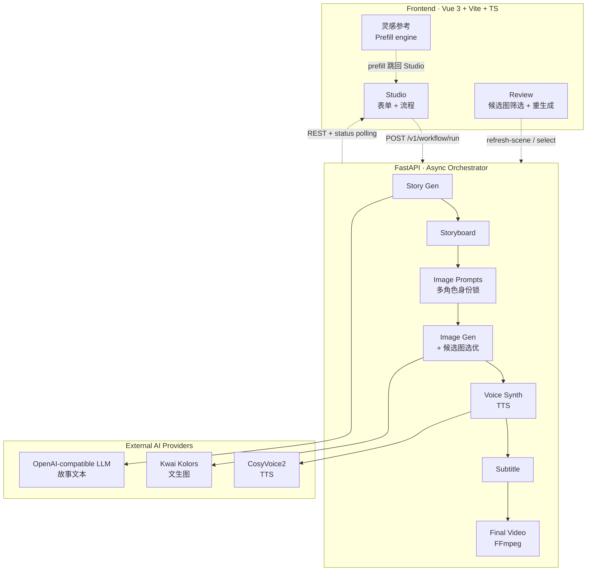

# Jinsie · AI Video Studio

> 从故事创意到视频成片的 AI 创作工作台 —— 给孩子讲一个温暖的故事，让 AI 把它变成一支带画面、旁白、字幕的绘本风视频。

[](https://fastapi.tiangolo.com/)
[](https://vuejs.org/)
[](https://www.typescriptlang.org/)
[](https://kling.kuaishou.com/)
[](https://www.siliconflow.com/)

---

## 这是什么

一条**多模态生成流水线**，把一句创作主题（如「小白兔和小松鼠的森林冒险」）变成一支 60–120 秒的儿童绘本风视频。完整流程涵盖：**故事生成 → 分镜规划 → 画面提示词 → 候选图生成 → 人工/自动审核 → 旁白合成 → 字幕生成 → 视频合成**，并提供创作者向的 Studio 工作台用于配置、审核和迭代。

技术栈一句话：**Vue 3 / TypeScript 前端 + FastAPI 异步后端 + 多 provider 抽象层（Kolors / CosyVoice2 / OpenAI-compatible LLM）+ FFmpeg 视频合成**。

---

## 演示

Studio 主创作台、画面审核、灵感参考三个 tab 构成一个完整产品闭环：

| 模块 | 截图位置 | 说明 |
|---|---|---|
| **首页 Hero** | [frontend/public/hero/](frontend/public/hero/) | 暗金主题首屏 + 老鼠/月光绘本插画 |
| **样片展示** | [frontend/public/showcase/](frontend/public/showcase/) | 4 段已生成的故事视频样片（mp4） |
| **Studio 主界面** | 跑起来访问 `/studio` | 故事配置 + 流程节点 + 实时状态 |
| **画面审核 (Review)** | Studio 第二个 tab | 候选图 A/B 切换、单场景重新生成、增强画质 |
| **灵感参考** | Studio 第三个 tab | 12 张配置卡 · 一键预填创作表单 |

---

## 架构概览



**12 个 REST endpoint**：`/v1/workflow/run` 为异步主入口，立即返回 `workflow_id`；前端通过 `/v1/workflow/status/{id}` 轮询，状态为 `completed` 后拉 `/v1/workflow/results/{id}` 拿最终 outputs。画面审核走独立的 `/v1/image-review/refresh-scene` / `/select` 路径，支持单场景重生成而不重跑整条 pipeline。

---

## 关键工程决策

这一节是写给读代码的人看的——讲**为什么这么做**，而不是**做了什么**。

### 1 · Provider 抽象 + 归档 Schema

`app/services/image_provider_adapter.py` 把 Kolors / 占位 Pillow / 未来分镜 provider（可灵 / 海螺 / 即梦）抽象成统一 `ImageGenerator` 接口；`image_provider_queue.py` 负责候选图任务的批量调度、退避重试和缓存。**v1 走绘本风文生图，v2 路线图里会接 reference-image 类视频 provider**，schema 上已经预留了 `img2img_reference_path`、`reference_images` 字段。

### 2 · 异步 workflow + 长任务用户体验

真实 Kolors 接口生成 6–12 张候选图通常需要 30–90 秒。后端写入 `assets/mock/<workflow_id>/status.json`，前端**轮询状态文件**（先 status，`completed` 后再 results），避免无限对 `outputs.json` 发 404 请求。Status 内还包含 **step 级进度**（当前在哪一步、已完成多少步），所以长任务不会出现"运行中"几分钟没反馈的尴尬。

### 3 · 候选图选优器 + 视觉验证

`app/services/image_candidate_selector.py` 为每个场景生成的 A/B 候选图打分。基础打分使用 metadata（required characters、prompt match、scene contract）；可选启用 `IMAGE_REVIEW_VISION_ENABLED` 后会调用视觉大模型做 **真画面级语义验证**——识别"兔子背了乌龟壳"这种多角色身份串扰，强扣分或直接判失败重生成。

### 4 · 多角色身份锁 + 跨角色互斥

多角色故事（如「兔子和乌龟赛跑」）容易出现 LLM 把角色特征混淆。`runner_character_manifest.py` + `runner_scene_characters.py` 在 prompt 层做了：
- 每个角色的 `visual_traits` / `forbidden_traits` 双向锁
- **跨角色互斥约束**：兔子 prompt 自动写入 "must avoid turtle shell"，乌龟 prompt 写入 "must avoid rabbit ears"
- 全局 negative_prompt 屏蔽 `hybrid rabbit turtle creature` 这类杂交描述

涉及文件 / 决策详见 [docs/post_refactor_todo.md](docs/post_refactor_todo.md) 中 BUG-004 / BUG-005 / BUG-006 三条记录。

### 5 · Inspiration Library · Prefill Engine

第三个 tab "灵感参考" 不是一个独立功能，而是一个**对外的 prefill 入口**：每张卡承载 4–8 个表单字段的预设组合（角色名 / 物种 / 视觉外观 / 故事种子 / 画面风格 / 时长 / 配音）。点击 → 浅合并入 `workflowForm` → 自动跳回 Studio → 用户只需要轻微调整就能生成。新用户冷启动时间从填表 5 分钟降到一次点击。

数据驱动：见 [frontend/src/data/inspirationLibrary.ts](frontend/src/data/inspirationLibrary.ts)。

### 6 · 渲染回退（Real → Mock）

后端图像 / 音频 / 视频 provider 都接了**真接口 → Mock 回退**模式：环境变量未配置或外部接口长时间失败时自动回退到本地 Pillow 占位图 / 静音 mp3 / 占位 mp4，**整条 workflow 永远跑得通**。这让 demo 演示和单元测试都能在零外部依赖的情况下运行。

### 7 · 双主题（Dark Gold + Pearl Dawn）

`frontend/src/style.css` 定义 `:root[data-theme="pearl"]` 完整 token 覆盖。所有组件用语义化变量（`--bg-*` / `--text-*` / `--border-*` / `--arc-*` / `--surface-overlay-*`）而非硬编码颜色，主题切换瞬时生效。

---

## Pipeline 详解

```
┌─────────┐     ┌─────────┐     ┌──────────┐     ┌──────────┐
│  Topic  │ ──▶ │  Story  │ ──▶ │Storyboard│ ──▶ │  Image   │
│ (用户)  │     │  (LLM)  │     │  (LLM)   │     │ Prompts  │
└─────────┘     └─────────┘     └──────────┘     └─────┬────┘
                                                       ▼
                  ┌─────────────────────────────────────┐
                  │ Image Gen (Kolors · 每场景 2 候选图) │
                  └──────────────┬──────────────────────┘
                                 ▼
              ┌───────────────────────────────┐
              │ Candidate Selector            │
              │ ├ metadata score              │
              │ └ optional visual verifier    │
              └──────────────┬────────────────┘
                             ▼
        ┌──────────────────────────────────────────┐
        │ Image Review (auto / manual mode)        │
        │ · 单场景重生成、A/B 切换、增强画质         │
        └──────────────┬───────────────────────────┘
                       ▼
            ┌──────────────────────────┐
            │ Voice / Audio Synth      │
            │ ├ 旁白 (CosyVoice2)       │
            │ └ 多角色对白可分配不同声线 │
            └──────────┬───────────────┘
                       ▼
              ┌────────────────────┐
              │ Subtitle Gen + SRT │
              └─────────┬──────────┘
                        ▼
                ┌──────────────────┐
                │ Final Video      │
                │ (FFmpeg compose) │
                └──────────────────┘
```

---

## 快速开始

```bash
# 0. 依赖
python3 -m venv .venv && source .venv/bin/activate
pip install -r requirements.txt

cd frontend && npm install && cd ..

# 1. 配置 .env (复制示例)
cp .env.example .env
# 至少填一个 LLM_API_KEY (OpenAI 兼容接口) 让故事生成跑得起来；
# Kolors / CosyVoice2 可选，缺省会回退到 mock 资产。

# 2. 启动后端 (port 8004)
make api

# 3. 启动前端 (port 5173)
cd frontend && npm run dev
```

访问 [http://localhost:5173](http://localhost:5173)，从首页点击 `Start Creating` 进入 Studio。

**5 分钟体验路径**：进入 Studio → 切到 "灵感参考" tab → 点击「米米 · 小白兔」卡片 → "用此角色创作" → 回到创作页（表单已预填）→ 直接点 "生成视频"。

---

## 仓库结构

```
.
├── app/                         # FastAPI 后端
│   ├── main.py                  # 12 个 REST endpoint
│   ├── schemas/workflow.py      # Pydantic 输入/输出契约
│   └── services/
│       ├── runner.py            # Workflow orchestrator (待重构)
│       ├── runner_*_support.py  # Step-level helpers
│       ├── image_provider_*.py  # 多 provider 抽象
│       ├── image_candidate_*.py # 候选图选优
│       └── runner_character_*.py# 多角色身份锁
│
├── frontend/                    # Vue 3 + Vite + TS
│   ├── src/views/StudioView.vue # Studio 主界面
│   ├── src/components/
│   │   ├── InteractiveImageReview.vue   # 画面审核
│   │   ├── InspirationLibraryPanel.vue  # 灵感参考
│   │   └── landing/LandingPage.vue      # 首页
│   └── src/data/inspirationLibrary.ts   # Prefill 数据
│
├── docs/
│   └── post_refactor_todo.md    # 已知问题 + 路线图 (透明)
│
├── assets/                      # 运行时产物 (image/audio/video)
├── scripts/                     # 验收 + 工具脚本
└── Makefile                     # api / check 入口
```

---

## v2 路线图

| 方向 | 工程量 | 状态 |
|---|---|---|
| Runner orchestrator 拆 god class（真重构，非 file-split） | 3–5 天 | 计划中，详见 [docs/post_refactor_todo.md](docs/post_refactor_todo.md) |
| **分镜视频 Provider 接入**（可灵 / 海螺 / 即梦） | 视 provider 商业模型 | 已预留 schema，等成本/可用性 |
| 角色 reference-image 一致性（img2img 或 LoRA） | 2–3 天 | 设计中 |
| 用户上传自家照片当角色 | 2 天 | 设计中 |
| 视觉验证器自动重试低分候选图 | 1 天 | metadata gate 已落地，视觉重试待做 |

---

## 已知问题与诚实声明

- `app/services/runner.py` 仍是个 1700+ 行的 god class。20+ 次"refactor"只是把代码移到 helper 文件并保留 `self._runner` 回调，**结构耦合没有真改变**，下一轮需要重构。
- 候选图的多角色一致性在纯 text-to-image provider 上有天花板，单纯叠 prompt / negative prompt 已接近极限。要质变需要 reference image / img2img / LoRA。
- 增强画质按钮已下线——Kolors 文生图无法做到「同一张图、更高画质」（不同 inference steps 必然产生不同图）。重新生成保留，定位为「换一张」。

完整问题清单见 [docs/post_refactor_todo.md](docs/post_refactor_todo.md)。

---

## License

私有项目 · All rights reserved.
